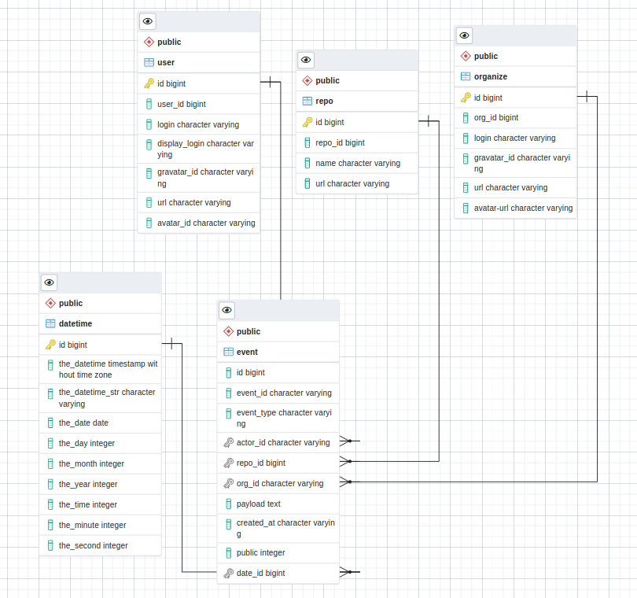

# Github Event ETL

## Project Preparation  


1. Update configuration by copy `env.sample` to `.env`, then change value to  
    - `DB_HOST`: host name (Docker: `localhost`)
    - `DB_NAME`: Schema name (Docker: `etl`)
    - `DB_USER`: Database's username (Docker: `etl`)
    - `DB_PASS`: Password (Docker: `etl-secret`)
    - `DAYS_BEFORE`: Number of days from today back for start `datetime` preparation (Optional: 10)
    - `DAYS_AFTER`: Number of days from today ahead for finish `datetime` preparation (Optional: 10)
    - `BATCH_SIZE`: Number of batch size to save data as bulk insert (Optional: 100,000)

1. Start database container with Docker (Postgres + PGAdmin)  
    ```
    $ docker compose up
    ```

1. Install dependencies by `venv`  
    ```
    $ python3 -m vevn venv && souce venv/bin/activate
    $ pip install -r requirements.txt
    ```

    In case of error raised while installing psycopg2 on macOS, it can fix by run command  
    ```
    $ brew postgresql-upgrade-database
    ```

    Then, run command  

    ```
    $ pip install -r requirements.txt
    ```

## ETL action mode

### setup
    To define all tables from scratch. 
    This command will drop all tables, if it already exists.

    ```
    $ python eventcapture.py --mode=setup
    ```

### datetime

    This command will pre-calculated date and time and then store in `datetime` table

    ```
    $ python eventcapture.py --mode=datetime
    ```

### etl

    To read github event from the example file and public event 
    by reading public event via API by run this command

    ```
    $ python eventcapture.py --mode=etl
    ```

### all

    This mode will do all in order start with `setup`, `datetime`, and `etl`

    ```
    $ python eventcapture.py --mode=all
    ```

## Data modeling

    Modeling diagram

