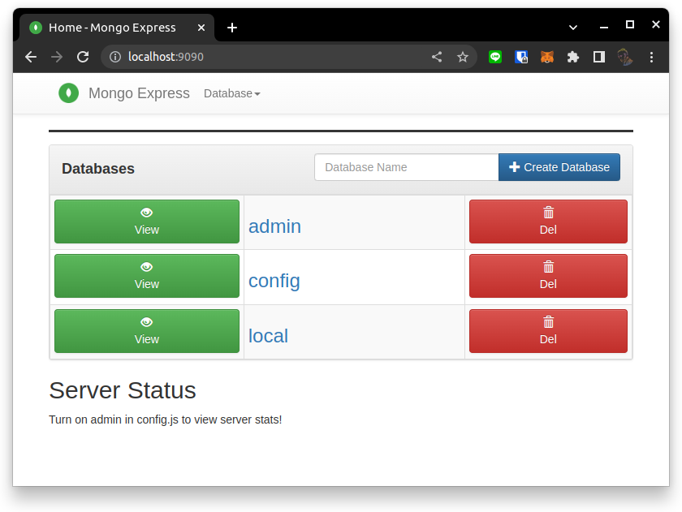
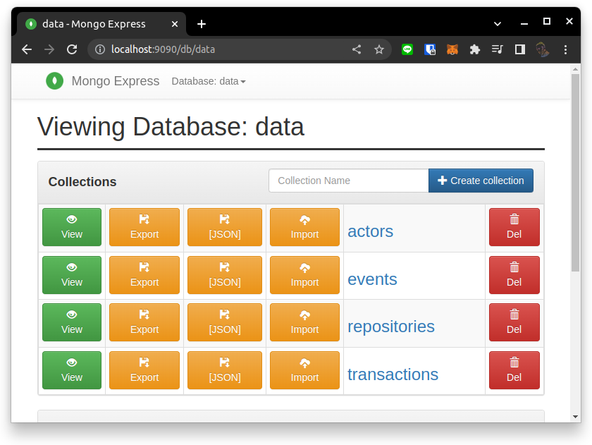
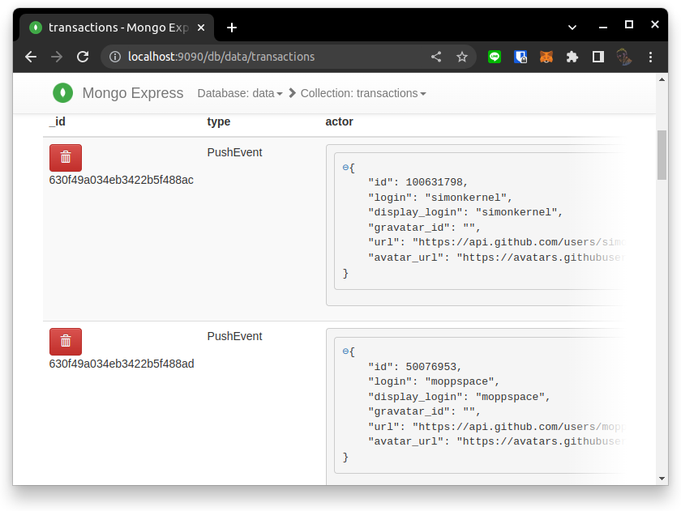

# Week 2: Data Modelling II - Insert github events into MongoDB

## Setup instruction

1. Copy `env.sample` to `.env` and update value as you want  
    * `DB_HOST`: Database's host name 
    * `DB_NAME`: Database name 
    * `DB_USERNAME`: Username of this database
    * `DB_PASSWORD`: Password of user 

1. Open new terminal and execute command below to start docker with MongoDB 
and MongoDB-Express.
    ```
    $ docker-compose up
    ```

    To stop docker by pressing `Ctrl-C` in terminal and run command listed below.

    ```
    $ docker-compose up -d
    ```

1. All collections in database can be explore by open [http://localhost:9090](http://localhost:9090) as image shown below  


1. Prepare virtual lib by using virtual environment as listed below 
(Assume that `python3` exists on your computer 
to call `python` version `3.x` where `x > 7`)
    ```
    $ python3 -m venv venv && source ./venv/bin/activate
    $ pip install -r ./requirements.txt
    ```

## Code execution 

1. To insertion github events by run command listed below   

    ```
    $ python github-enventscapture.py
    ```
    **Remark:** `python` in this command represent to `python` 
    in virtual environment as we prepared in the previous step 

## Example data
1. After execute code above, web ui should display 4 collections in `data` database 
as listed below


1. To explore data that saved into collection by select collectioon name
information in that collection will be listed as image that showsn below 


## Data Collections

1. Transactions: this collection keep all events sorted by event's timestamp.
1. Events: this collection categorized event by type 
and store number of type that happends.
1. Actor: the collection of actor who performed event separated by event types.
1. Repository: this collection collect all events that happends 
with each repositories categorized by types